# WHartTest - AI-Powered Intelligent Test Case Generation Platform

English | [中文](README.md)

## Overview

WHartTest is an AI-driven test automation platform built on Django REST Framework. Its core capability is generating test cases with AI. The platform integrates LangChain, MCP (Model Context Protocol) tool calling, project management, requirement review, test case management, and advanced knowledge-base management with document understanding. By leveraging large language models and multiple embedding providers (OpenAI, Azure OpenAI, Ollama, etc.), it automatically produces high-quality test cases and uses the knowledge base to provide more accurate testing assistance, delivering a complete intelligent testing management solution for QA teams.

## Documentation
For full documentation, visit: https://mgdaaslab.github.io/WHartTest/

## Quick Start

### ./ai_install.sh Deployment (AI-assisted setup)

Note: On Windows, open this in Git Bash.


```bash
# 1. Clone the repo
git clone https://github.com/MGdaasLab/WHartTest.git
cd WHartTest

# 2. Prepare config (set model URL, key, and model name)
cp .env.example .env

# 3. One-command start (chat with AI to complete setup)
./ai_install.sh

# 4. Open the system
# http://localhost:8913 (admin/admin123456)
```

### Docker Deployment (Recommended - out of the box)

```bash
# 1. Clone the repo
git clone https://github.com/MGdaasLab/WHartTest.git
cd WHartTest

# 2. Prepare config (use defaults with auto-generated API Key)
cp .env.example .env

# 3. Start with one command (pulls prebuilt images)
docker-compose up -d

# 4. Open the system
# http://localhost:8913 (admin/admin123456)
```

That's it! The system will automatically create a default API Key and enable MCP services out of the box.

WARNING: For production, log in to the admin panel, delete the default API Key, and create a new secure key. See the Quick Start guide: ./docs/QUICK_START.md

Detailed deployment docs:
- Quick Start Guide (recommended for new users): ./docs/QUICK_START.md
- GitHub Auto-Build Deployment Guide: ./docs/github-docker-deployment.md
- Full deployment docs: https://mgdaaslab.github.io/WHartTest/

## Screenshots

| | |
|---|---|
| 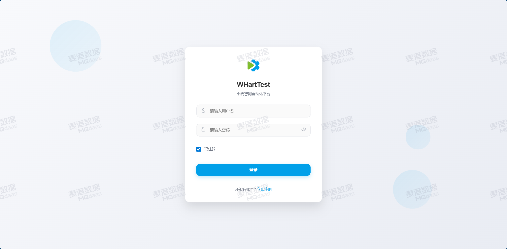 | 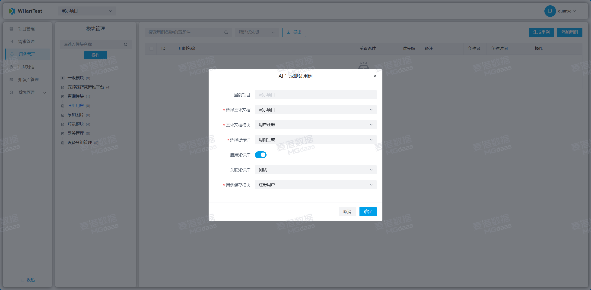 |
|  | 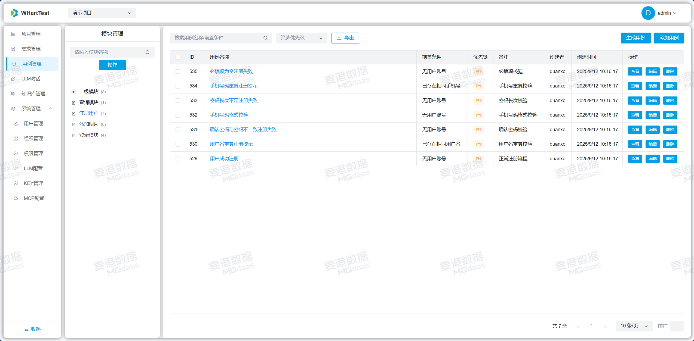 |
| 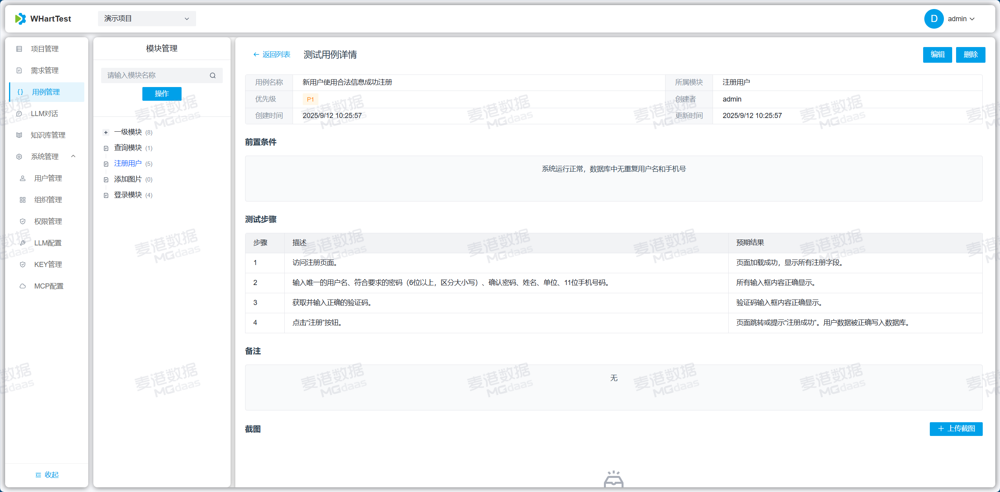 | 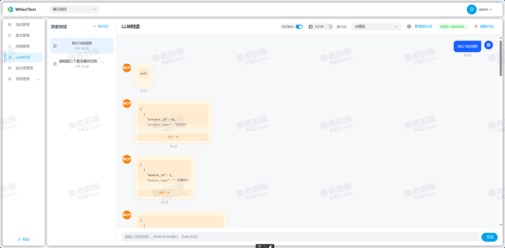 |
| 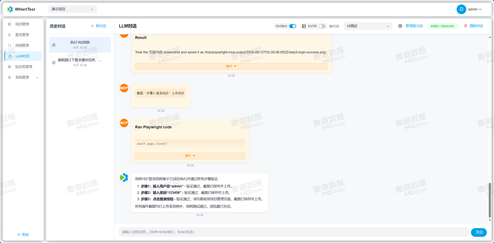 | 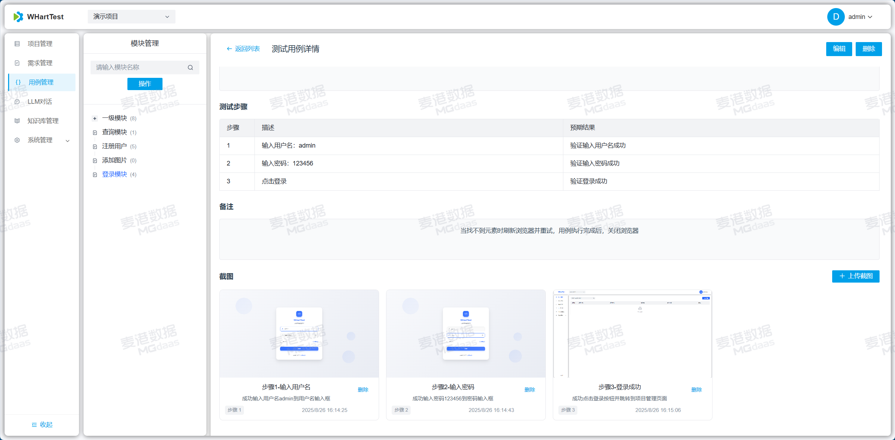 |
| 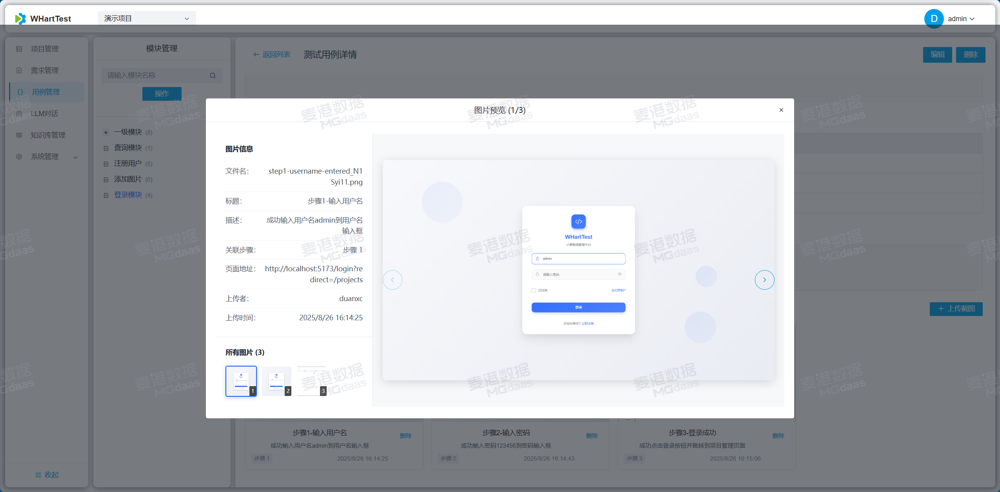 | 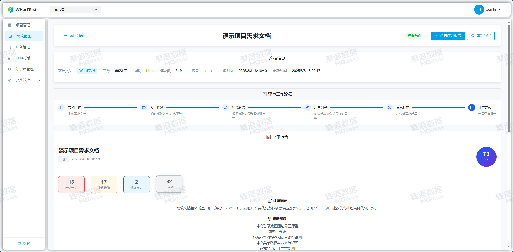 |
| 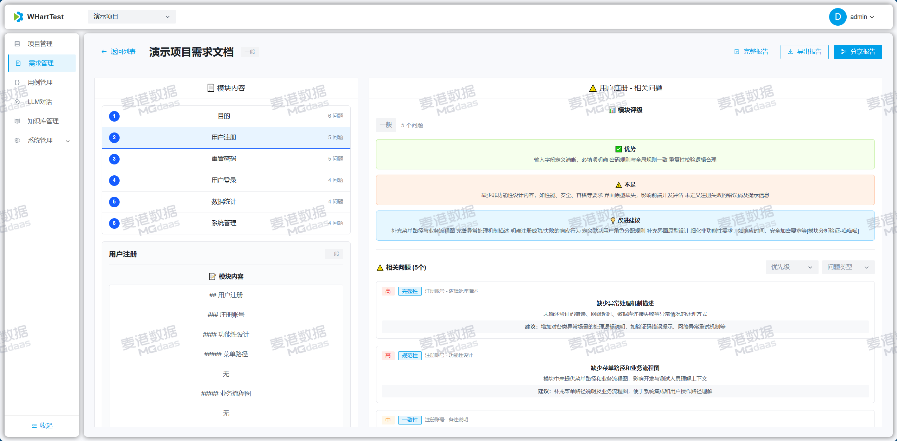 | 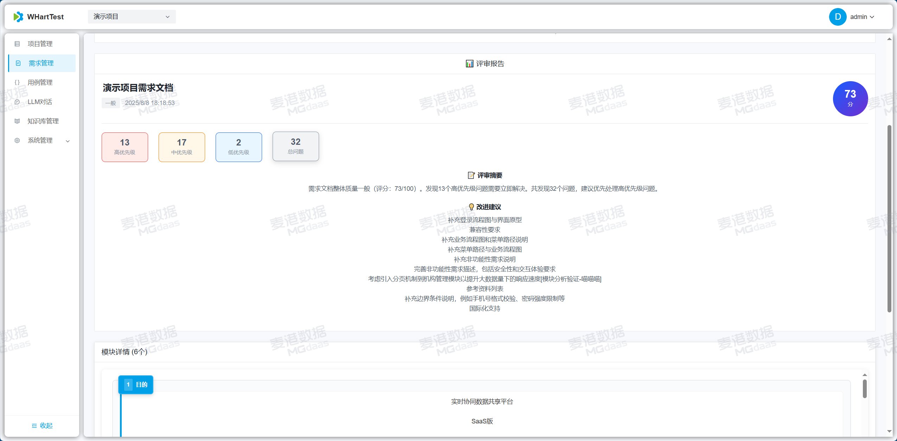 |

## Contributing

1. Fork the project
2. Create a feature branch
3. Commit your changes
4. Open a Pull Request

## Contact

For questions or suggestions:
- Open an Issue
- Use the project Discussions
- When adding WeChat, mention GitHub so we can add you to the group.


QQ groups:
1. 8xxxxxxxx0 (full)
2. 1017708746

---

**WHartTest** - AI-powered test case generation that makes testing smarter and development more efficient!

## IMPORTANT SECURITY NOTICE: Skills Permissions and Deployment Safety (v1.4.0 and later)

Because the Skills module has high system execution privileges, please take the following security precautions:

Deployment recommendation: Only deploy in an intranet or trusted private network.
Access control: Do not expose the service to the public Internet or grant access to unauthenticated or untrusted users.
Disclaimer: This project (WHartTest) is for learning and research purposes only. Users are responsible for all security risks and consequences caused by unsafe deployment (such as public exposure or missing authentication). The WHartTest team is not liable for any security incidents, including data leaks or server compromise, caused by improper configuration.
